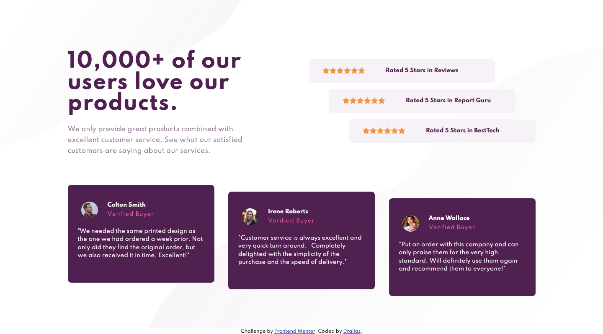

# Frontend Mentor - Four card feature section solution

This is a solution to the [Four card feature section challenge on Frontend Mentor](https://www.frontendmentor.io/challenges/four-card-feature-section-weK1eFYK). Frontend Mentor challenges help you improve your coding skills by building realistic projects. 

## Table of contents

- [Overview](#overview)
  - [The challenge](#the-challenge)
  - [Screenshot](#screenshot)
  - [Links](#links)
- [My process](#my-process)
  - [Built with](#built-with)
  - [What I learned](#what-i-learned)
  - [Continued development](#continued-development)
  - [Useful resources](#useful-resources)
- [Author](#author)


## Overview

### The challenge

Users should be able to:

- View the optimal layout for the site depending on their device's screen size

### Screenshot



### Links

- GitHub: [Add solution URL here](https://your-solution-url.com)
- GitHub Pages: [Add live site URL here](https://your-live-site-url.com)

## My process

### Built with

- Semantic HTML5 markup
- CSS Grid and Flexbox using BEM
- Mobile First approach 

Planning this project before building it, it seems fun to me, to make grid wrapper using flexbox in the bottom row for the card items. In my workflow I first built the mobile layout and responsive desktop as an outline. When those basic layouts where good, I moved on to adding the graphical details. 

### What I learned

Still learning about grid, i learned to forget to specify grid-area values (otherwise weird things happens to the layout). I'm also 'forcing' myself this time not to use exact values but trying to rely on **fr** values.  

My desktop grid :

```css
  .grid {
    grid-template-rows: 1.1fr 1fr;
    grid-template-columns: 1fr 1fr;
    grid-template-areas:
      "grid__header grid__ratings"
      "grid__cards grid__cards";
    gap: 10px 15px;
  }

```
### Continued development

I need to improve CSS naming and BEM naming too. I guess even i'm just starting out with **CSS Grid** that i'm already more comfortable with it than **CSS Flexbox** . This challenge also used Flexbox and it feels a bit like a Flexible (Black) Box, so i need to put extra effort improving my understaning of Flexbox. :) 

### Useful resources

- [CSS Tricks - Flexbox](https://css-tricks.com/snippets/css/a-guide-to-flexbox/) - To figure out flexbox properties. 

## Author

- Frontend Mentor - [@Drallas](https://www.frontendmentor.io/profile/Drallas)
- Dev.to - [@Drallas](https://dev.to/drallas)

